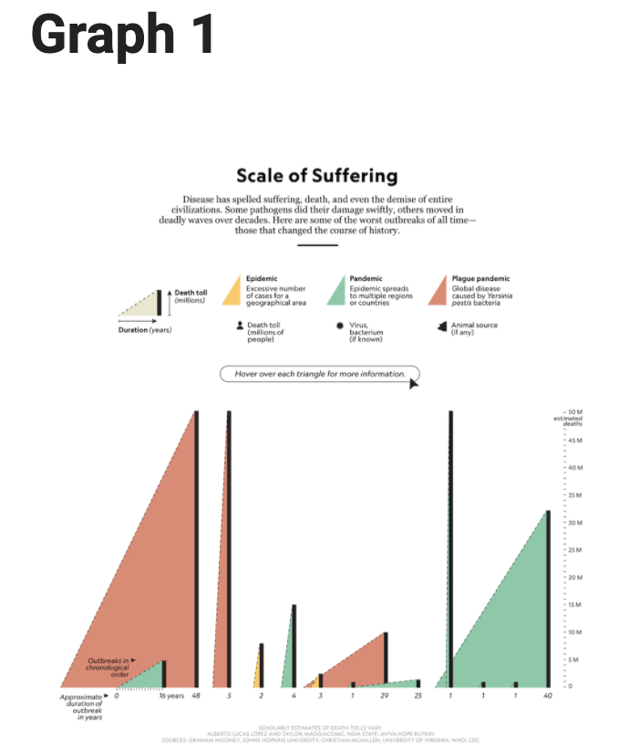
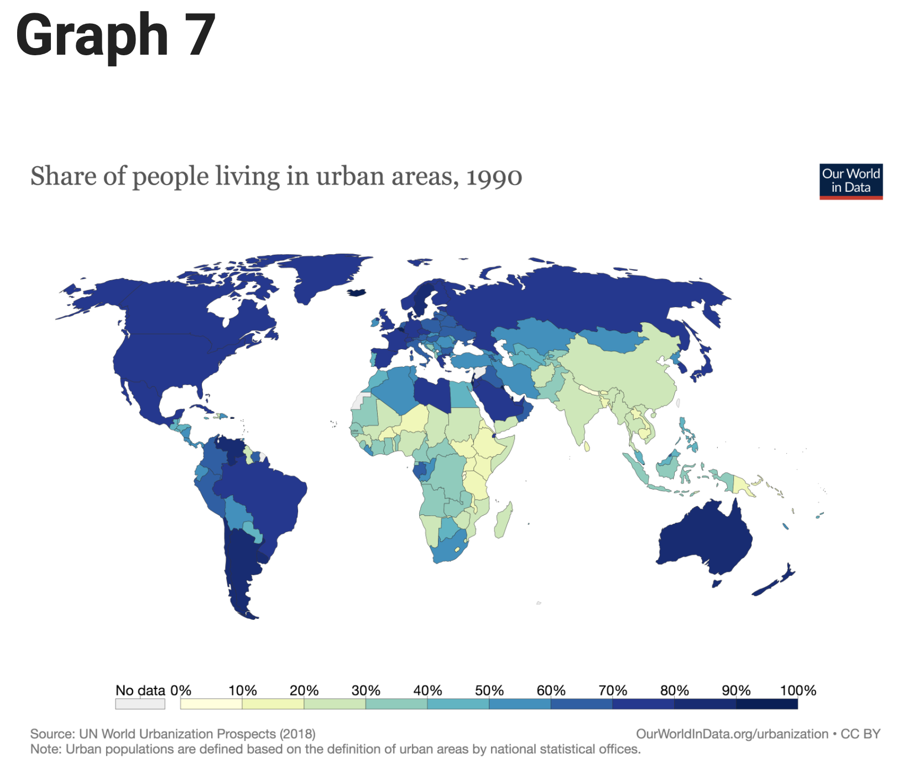
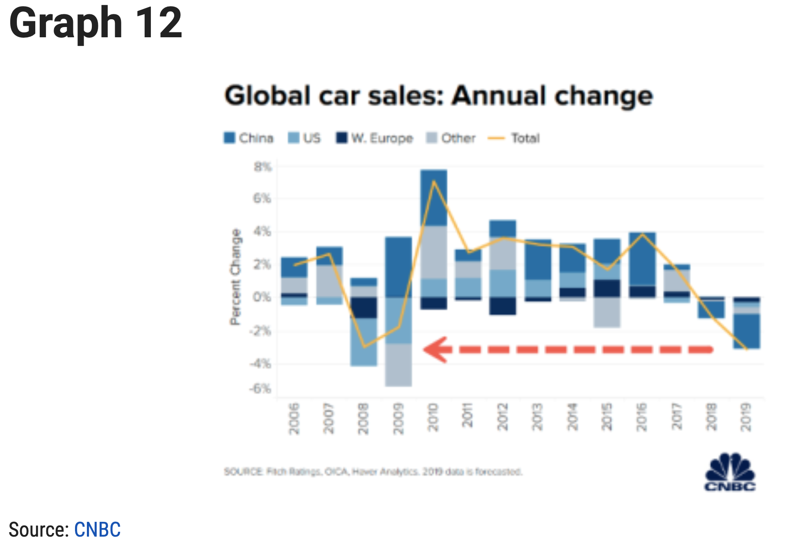
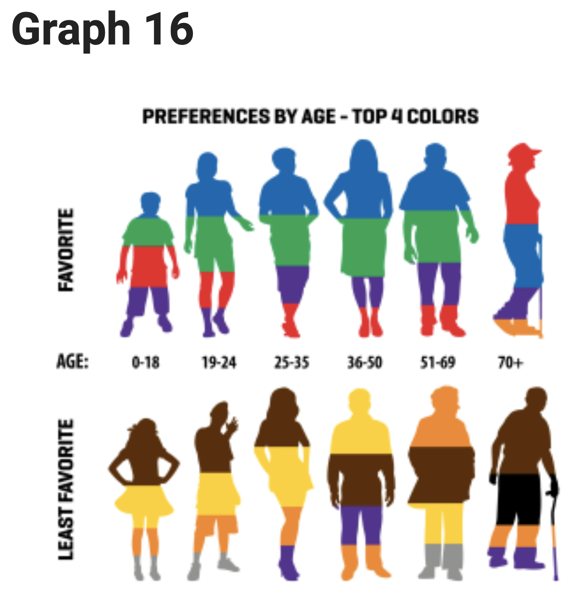

### Assignment two:

## Question:

1. Whether you feel the chart is good or bad
2. A criticism of the chart, and
3. Ways to improve the chart

## Plot One:

Graph 1: 

I think this picture is bad. 

First of all, its axis is very unclear because its x-axis is the approximate duration of outbreak years, but the x-axis is showing the values of the various different suffering instead of a unified axis. Furthermore, this chart goes on to use different images of death roll, virus and bacterium, and animal source, which are very similar, and which are not used in the chart below. Lastly, the whole image is very difficult to understand and you need to consider both the length and width of the triangle.

I think the first thing that could be done is to split this graph into two sheets to avoid having to use triangles in this way to represent two types of data sets while unifying the range of the x-axis.

## Plot Seven:

Graph 7:

I don't think this picture is good. 

To begin with, the proportions of this picture are wrong, the part at the top of the picture is flatter and the bottom of the picture is longer, so it gives a visual error. Also the color on the scale of the picture are closer together, that will not lead reader to distinguish and finally there is no information like country’s name on the map.
 
Firstly I would choose a colorbar with a large color difference to show scale, then I would add the names of the country where appropriate.

## Plot Twelve:

Graph 12:

I think this chart is bad. 

First of all, there are too many categories on one bar, and the difference between each category is sometimes small, and the colors chosen for each category are too similar, which makes it difficult for the reader to distinguish the data for each country. Lastly, there is a red arrow on the image, but it is not labeled in any way, which can mislead the reader.

I think I would consider using the facetgrid feature in seaborn package to map the different species separately, and then compare them uniformly.

## Plot Sixteen:

Graph 16:

I think this picture is not good. The top and bottom of the chart use different pictures to show range of age. For example, the top of the chart for 0-18 years old uses picture of boys, while the bottom uses picture of girls. The colors are also not named, which could be misleading to readers who have problems with color perception.
My solution is to first set the top and bottom images the same and finally name the 8 colors the image includes.

