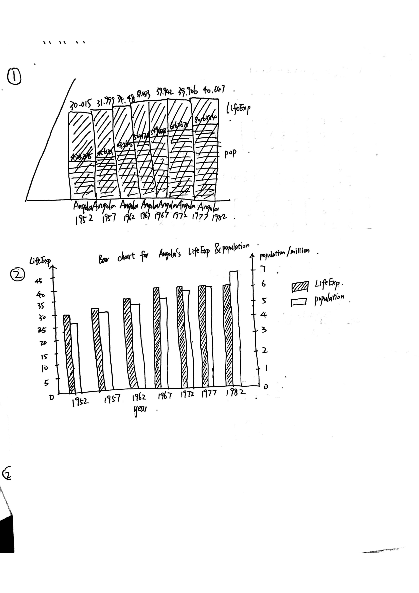
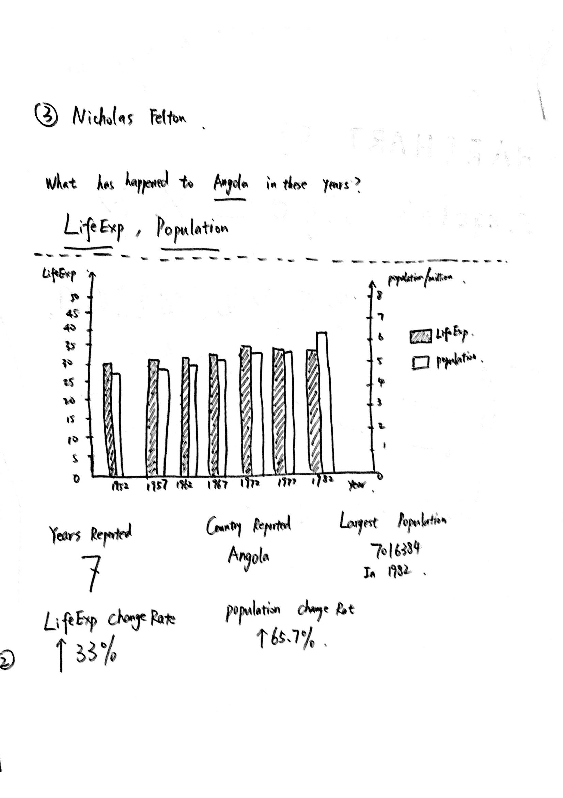
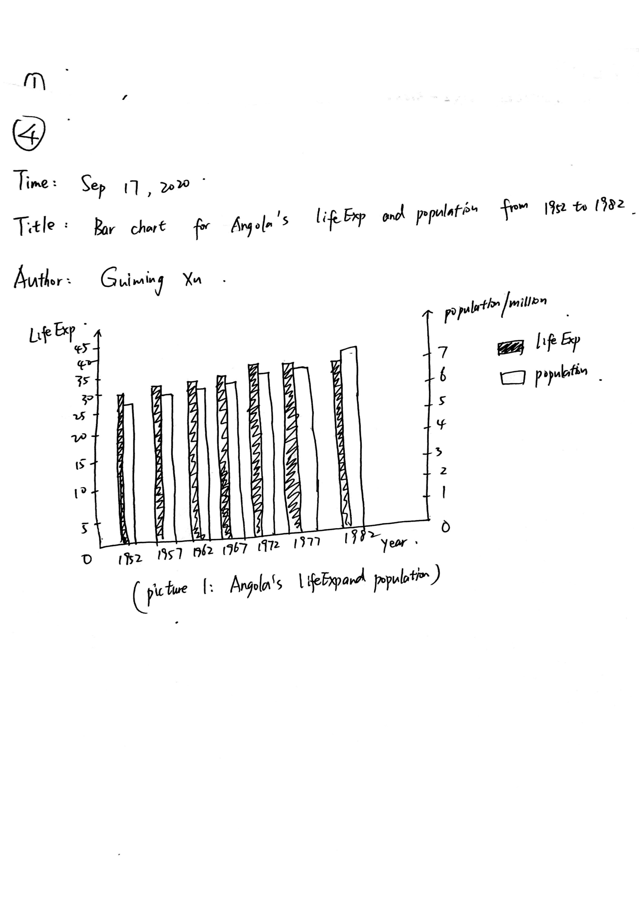
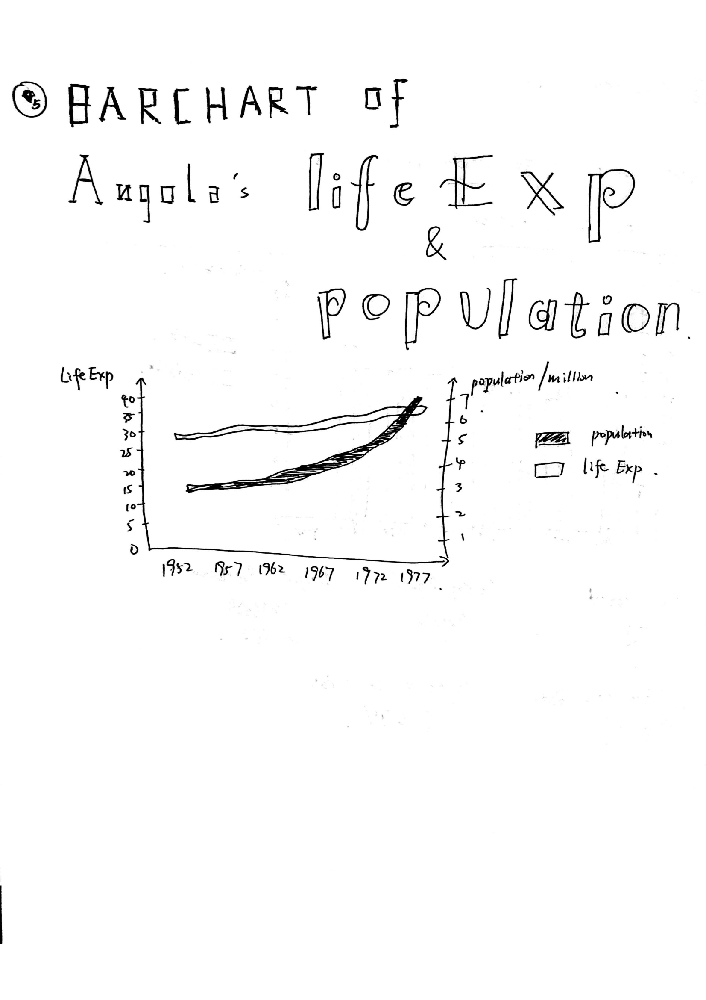

## Assignment 3

### Question:

1. Visualize the data and make it as ugly as you can. Seriously. Really ugly it up. Disregard readability, clarity, and understanding. Maybe make it misleading. Go to town. How ugly can you go?

2. Edit your ugly chart to make it readable.
Change the aesthetic to make the readable chart look like it belongs in one of Nicholas Felton (Links to an external site.)’s reports.

3. Change the aesthetic to make the readable chart look like it came from a news publication.

4. Change the aesthetic to make the readable chart look like it belongs in an art gallery.

5. If you’re feeling bold, try visualizing the data in a medium you’re not used to.

