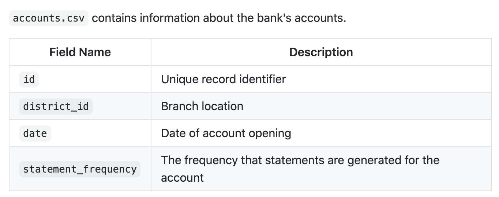
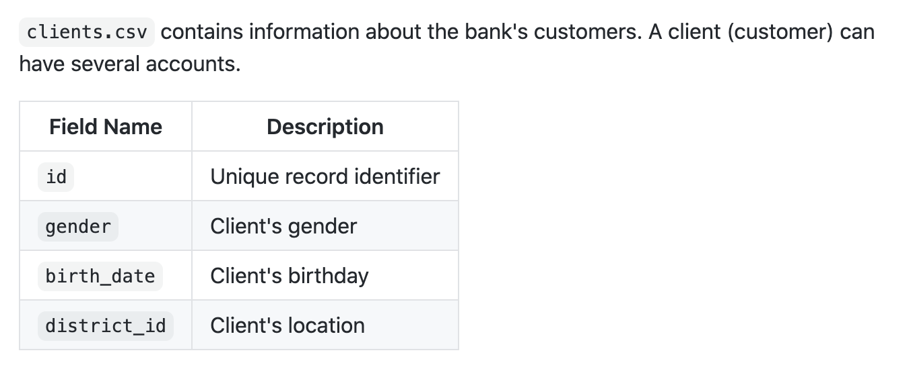
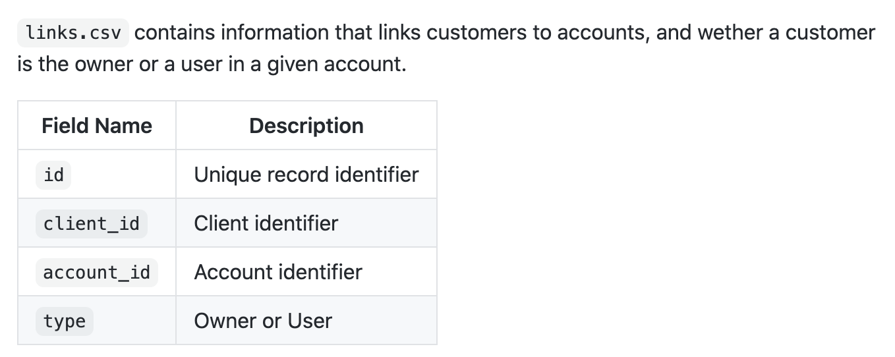
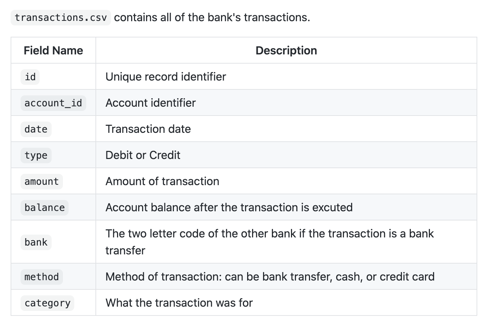
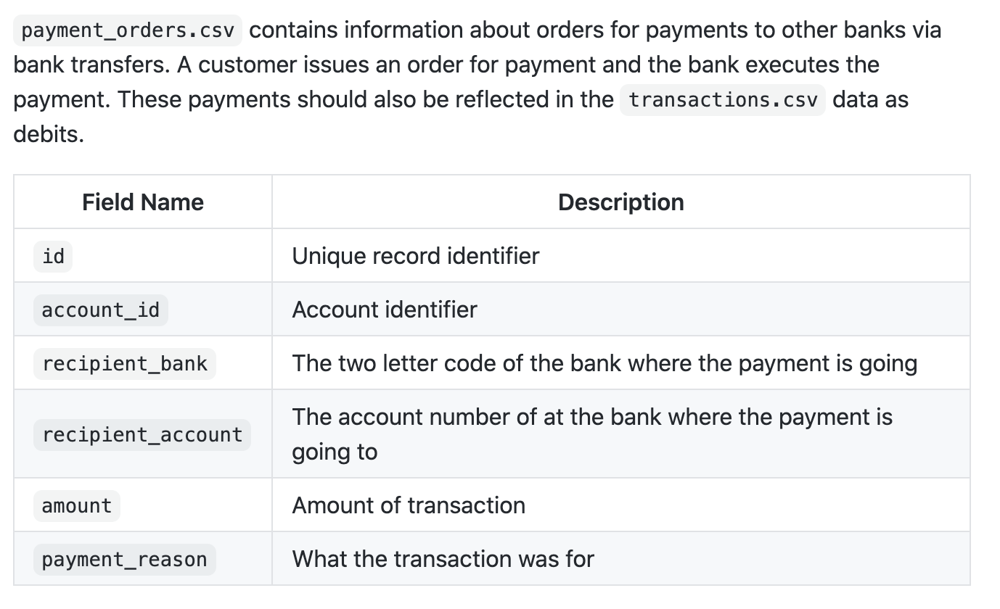
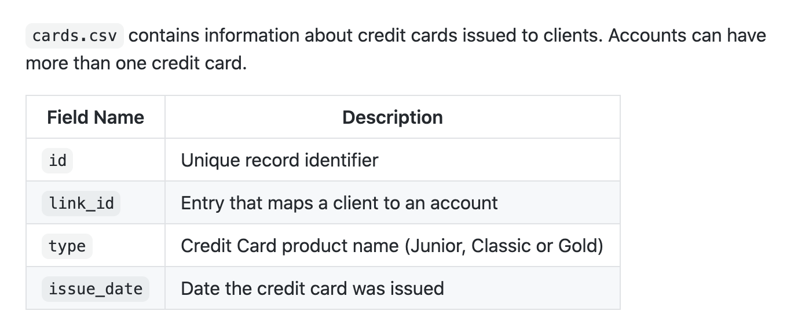
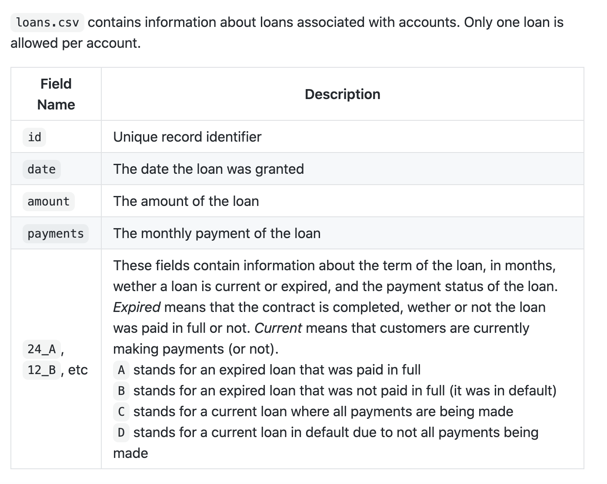
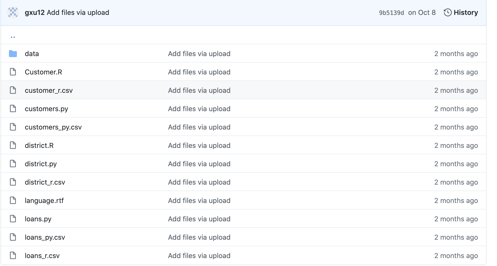

## Assignment 4:

### Question:

Data Wrangling Assignment

### DataSet Introduction

### Analysis on the github web page

#### There is no visualization part
#### the website for this homework is: https://github.com/anly503/anly503-fall2020-a4-gxu12

