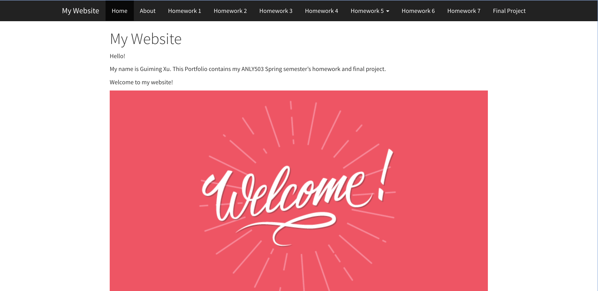
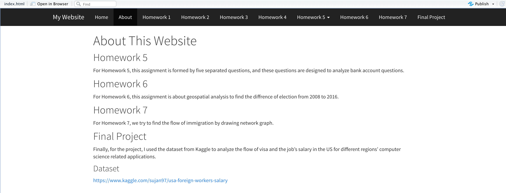

# ANLY503_Portfolio

# Introduction

Welcome to this website!

This website is build for showing my ANLY503 (Data Visualization Course) semester's homework and project

## Reminder

Because the shape file is too large (more than 100MB), I am not able to git push it to this repository.

So if you are interested, you can go to this website: *https://www2.census.gov/geo/tiger/TIGER2019/COUNTY/* to download the shape file

And then, put unzip folder into both **data** folder and **_site/data** folder

## Webpage Screenshot

Index Page:   

About Page:   

## Show html in your browser

After cloning this repository, click **_site** folder, and then click **index.html** file
