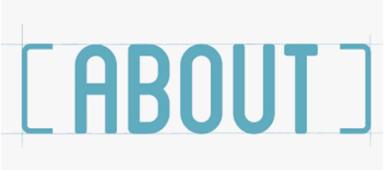

## Homework 5

For Homework 5, this assignment is formed by five separated questions, and these questions are designed to analyze bank account questions.

## Homework 6

For Homework 6, this assignment is about geospatial analysis to find the diffrence of election from 2008 to 2016.

## Homework 7

For Homework 7, we try to find the flow of immigration by drawing network graph.

## Final Project

Finally, for the project, I used the dataset from Kaggle to analyze the flow of visa and the job's salary in the US for different regions' computer science related applications.

### Dataset

https://www.kaggle.com/sujan97/usa-foreign-workers-salary

